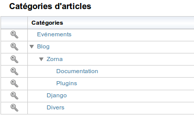

########################
Publication des articles
########################

*********
Préambule
*********
Les articles sont publiés dans des catégories d'articles. Les catégories d'articles sont organisées de manière hiérarchique ( sous forme d'arborescence ). Cette organisation permet à ZORNA de générer dynamiquement des menus hiérarchiques.
Un article peut être publié dans une ou plusieurs catégories. 

********************************
Création des catégories articles
********************************

Création
========
Seul l'administrateur peut créer des catégories d'articles. Pour celà il faut cliquer sur le lien "Administration -> Articles" et ensuite sur le lien "Ajouter une catégorie". Renseignez le nom de la catégorie d'articles. Indiquez son parent s'il y a lieu et sauvegardez en cliquant sur le bouton "Enregistrer".

Droits d'accès
==============
Une fois la catégorie créée, on doit spécifier ses droits d'accès.
Pour celà, cliquez sur l'image en forme de clé et configurer les droits d'accès. Vous pouvez spécifier les droits en utilisant les groupes ou les octroyer explicitement à des utilisateurs.

Pour définir les droits d'accès sur une catégorie, cliquez sur le bouton en forme de clé:

.. image:: ../../images/adm-rights.png

Pour chaque catégorie les droits d'accès sont définis comme suit:

* **Reader**: Le ou les groupes d'utilisateurs ayant le droit de lire les articles de la catégories
* **Manager**: Le ou les groupes d'utilisateurs ayant le droit de gérer les articles de cette catégorie
* **Writer**: Le ou les groupes d'utilisateur ayant le droit de publier des articles dans cette catégorie

************************
Publication des articles
************************

Liste de mes articles
=====================
Un utilisateur qui a le droit de publier des articles accède à l'espace de publication des articles par le menu "Utilisateur" en cliquant sur le lien "Publication". Il se retrouve avec la liste des articles qu'il a publié:

.. image:: ../../images/my-articles.png

Les articles avec une croix rouge sont des brouillons, c'est à dire qu'ils ne sont publiés dans aucune catégorie.
Les autres sont des articles en ligne et donc publiés dans au moins une catégorie.

Publication
===========
Pour publier un article, cliquez sur le lien "Rédiger un article"
Indiquez dans quelles catégories vous souhaitez plubliez cet article:

.. image:: ../../images/pub-categories.png

Indquez ensuite les éléments suivants:

* Titre de l'article
* Slug (il est mis à jour automatiquement). Vous pouvez le modifier si vous le souhaitez.
* En-tête de l'article
* Le corps de votre article. Un éditeur WYSIWYG vous facilite la mise en page
* Si vous souhaitez illustrer votre article, indiquez le fichier qui contient l'image dans le champ "Image"
* Vous avez la possibilité de joindre à votre article un ou deux fichiers.

Cliquez sur le bouton "Enregistrer" pour enregistrer et publier votre article.

Si vous souhaitez ne pas publier votre article tout de suite et de rester en mode brouillon, ne sélectionner aucune catégorie de publication.

Une fois l'article enregistré, vous avez la possiblité de supprimer l'image ou de remplacer.
De même pour les fichiers joints.
